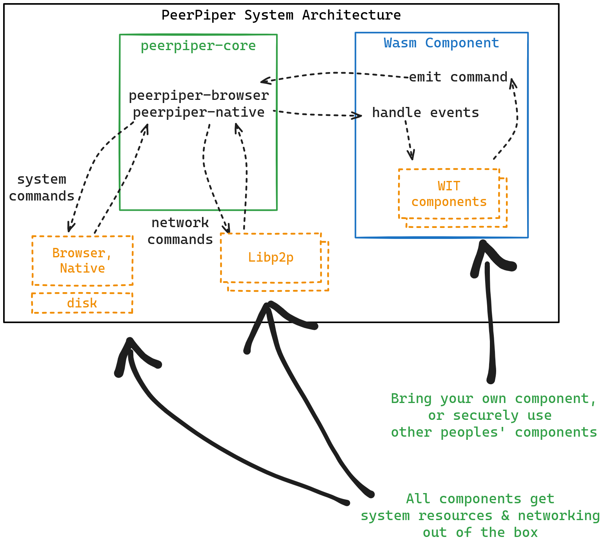

# PeerPiper Workspace Monorepo

The core Rust libraries and front-end examples for the PeerPiper project. Mainly holds the peer-to-peer networking logic, the core data structures, and how to use them.

The idea is to put all the reusable code in this repo so it can be linked and tested in its entirety.

# Goals

### 🔗 [PeerPiper Protocol GreenPaper](https://peerpiper.io/paper)

- [x] No blockchain required
- [x] Default [Peer-to-peer](https://en.wikipedia.org/wiki/Peer-to-peer) networking via [rust-libp2p](https://libp2p.io/)
- [x] [Modular, Composable Wallet](./crates/peerpiper-wallet/) (add your own plugins) via [Wasm Components](https://component-model.bytecodealliance.org/introduction.html)
- [x] [Plaintext Peer discovery](https://en.wikipedia.org/wiki/Peer_discovery) (name, email, phone, etc.) via [Delanocreds](https://github.com/DougAnderson444/delanocreds)
- [ ] 🚧 **Modular, Composable, Templatable** app & data sharing
- [ ] 🚧 Add your own publishing network (Nostr, Farcaster, AT Protocol, etc.)
 

# Deployment

The core library should include wrappers so that it can be deployed to various infrastructure providers:

- [x] Browser via [WebAssembly](https://en.wikipedia.org/wiki/WebAssembly)
- [ ] Browser via [Vite](https://vitejs.dev/) and [`wasm-bindgen`](https://rustwasm.github.io/docs/wasm-bindgen/)
- [x] [Command Line Application](https://en.wikipedia.org/wiki/Command-line_interface) via Rust
- [ ] [Tauri](https://tauri.studio/) home, mobile, and desktop
- [ ] [Shuttle](https://shuttle.dev/) via Rust
- [ ] [Fly.io](https://fly.io/) via Docker
- [ ] [Cloudflare Workers](https://workers.cloudflare.com/) via WebAssembly
- [ ] [VPS](https://en.wikipedia.org/wiki/Virtual_private_server) via Rust
- [ ] [Web3.storage](https://web3.storage/) via HTTP
- [ ] [Fireproof DB](https://use-fireproof.com/) via HTTP
